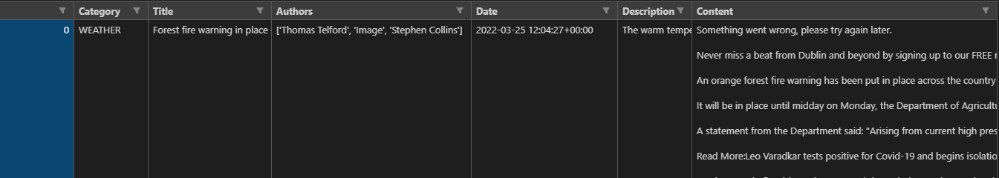

# News Datasets

## Dataset Format

**Dataset Fields :**  `{Category, Title, Authors, Date, Description, Content}`

## Folder

- [ ] Notes: When all types of news data have been collected, they will be merged into one `CSV` dataset file
- ***dataset*** (Weather news staging file)
  - [x] `Weather.csv` (Content data contains line break)
- ***dataset_code*** (Data collection code)
  - `article_extractor.py`
  - `extraction_links.py`

